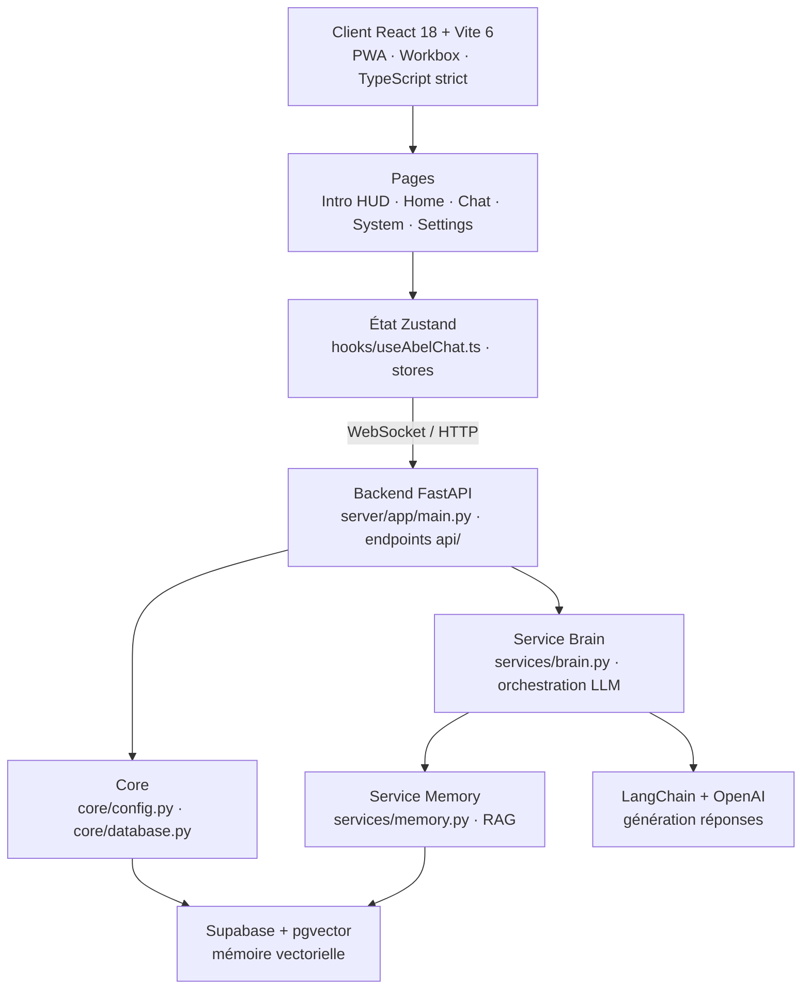

# A.B.E.L - Adam Beloucif Est Là

<!-- adam-badges:start -->
[](https://github.com/Adam-Blf/A.B.E.L/commits) [](https://hits.sh/github.com/Adam-Blf/A.B.E.L/) [](https://github.com/Adam-Blf/A.B.E.L/commits) [](https://github.com/Adam-Blf/A.B.E.L) [](LICENSE)
<!-- adam-badges:end -->


> **Assistant Personnel Intelligent** - Interface Cyberpunk PWA avec Chat AI, Mémoire RAG & Proxy API Universel

## Architecture



## Features

- [x] PWA installable (iOS, Android, Desktop)
- [x] Animation intro HUD Cyberpunk
- [x] Interface Command Center
- [x] Chat AI temps réel (WebSocket)
- [ ] Mémoire RAG avec pgvector
- [ ] Proxy API Universel (+1400 APIs)
- [ ] Authentification biométrique (face-api.js)
- [ ] Intégration Deezer

## Tech Stack

| Layer | Technology |
|-------|------------|
| Frontend | React 18 + Vite 6 + TypeScript |
| PWA | vite-plugin-pwa + Workbox |
| Styling | Tailwind CSS + Framer Motion |
| State | Zustand |
| Backend | FastAPI (Python) |
| Database | Supabase + pgvector |
| LLM | LangChain + OpenAI |

## Installation

### Prerequisites
- Node.js 20+
- Python 3.11+
- Compte Supabase (gratuit)

### Frontend

```bash
cd client
npm install
npm run dev
```

### Backend

```bash
cd server
python -m venv .venv
source .venv/bin/activate  # Windows: .venv\Scripts\activate
pip install -r requirements.txt
uvicorn app.main:app --reload
```

### Environment Variables

Copier `.env.example` vers `.env` et remplir les valeurs :

```bash
cp .env.example .env
```

## Structure

```
A.B.E.L/
├── client/              # Frontend React PWA
│   ├── src/
│   │   ├── components/  # UI Components
│   │   ├── pages/       # App Pages
│   │   ├── hooks/       # Custom Hooks
│   │   └── stores/      # Zustand Stores
│   └── public/          # Static Assets
│
├── server/              # Backend FastAPI
│   ├── app/
│   │   ├── api/         # Endpoints
│   │   ├── core/        # Config & DB
│   │   └── services/    # Business Logic
│   └── scripts/         # Utilities
│
└── docs/                # Documentation
```

## Commands

```bash
# Development
npm run dev          # Start frontend
uvicorn app.main:app --reload  # Start backend

# Build
npm run build        # Build PWA
npm run preview      # Preview build
```

## Changelog

### v1.0.0 (2025-01-20)
- Initial release
- PWA setup with vite-plugin-pwa
- Cyberpunk UI components
- Animation intro HUD
- Basic chat interface

---

**Author**: Adam Beloucif


---

<p align="center">
  <sub>Par <a href="https://adam.beloucif.com">Adam Beloucif</a> · Data Engineer &amp; Fullstack Developer · <a href="https://github.com/Adam-Blf">GitHub</a> · <a href="https://www.linkedin.com/in/adambeloucif/">LinkedIn</a></sub>
</p>